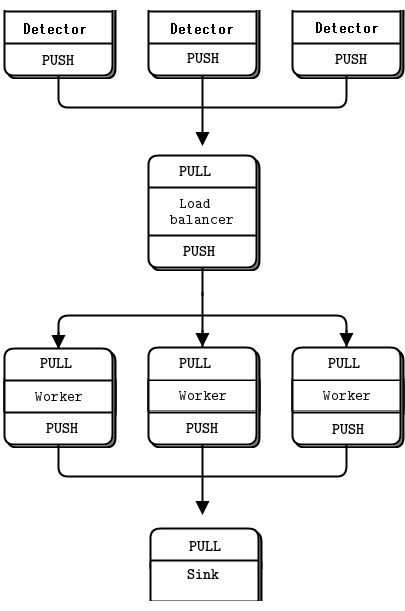

# ZeroMQ-DAQ-Emulation
Emulating a primitive multithreaded DAQ setup with fake detectors and event builders.

Requirements:
- pyzmq (tested on version 18.1.1)

## DAQ-push-pull.py:
- Simple PUSH-PULL network with no specialised redundancy beyond default offerings from ZeroMQ
- Scalable amount of detectors feed into a load balancer, which distributes the work to scalable amount of workers
- Workers perform event building and parse "hits" to a sink collector.

