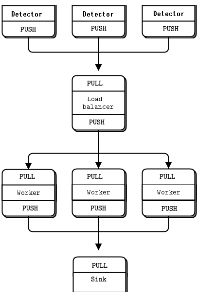

# ZeroMQ-DAQ-Emulation
Emulating a primitive multithreaded DAQ setup with fake detectors and event builders.

Requirements:
- pyzmq (tested on 20.0.2)

## DAQ-push-pull.py:
- Simple PUSH-PULL network with no specialised redundancy beyoing default offerings from ZeroMQ
- Scalable amount of detectors feed into a load balancer, which distributes the work to scalalble amount of workers workers performing event building and parsing "hits" to a sink collector.

Schematic:

